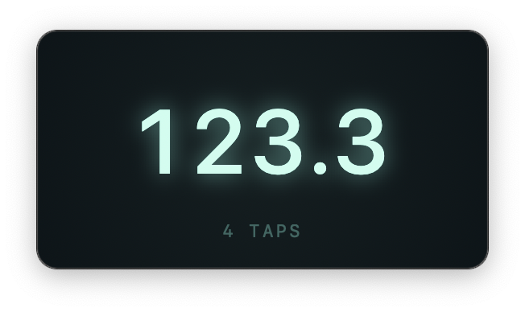

# TapBeat

Ultra-light macOS BPM counter. Press spacebar (or click the window) to tap tempo; Esc or R to reset.



## Build

### Debug

```bash
xcodebuild -project TapBeat.xcodeproj -scheme TapBeat -configuration Debug -derivedDataPath build
open build/Build/Products/Debug/TapBeat.app
```

### Release

```bash
xcodebuild -project TapBeat.xcodeproj -scheme TapBeat -configuration Release -derivedDataPath build
open build/Build/Products/Release/TapBeat.app
```

To install the Release build:

```bash
cp -R build/Build/Products/Release/TapBeat.app /Applications/
```
